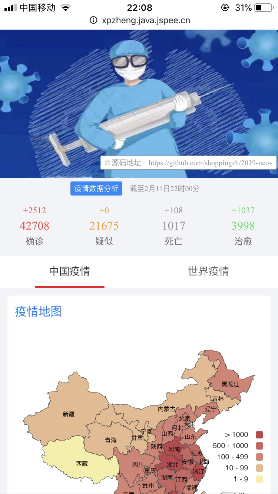

# 2019-ncov
2019武汉肺炎数据分析

## 截图
> 更多截图请见[截图列表](screenshots)



## client
### 安装与使用
```
npm install
npm run serve
```


## server
基于spring boot的服务端，提供了获取疫情数据的API，支持CORS跨域访问。

**注：此服务端暂没有部署，前端使用jsonp获取新浪新闻的数据**


## ChangeLog
#### v1.0 (2019/02/07)
- 确诊/疑似/死亡/治愈数预览
- 确诊/疑似/死亡/治愈今日增长数预览
- 全国疫情地图
- 世界疫情地图

#### v1.1 (2019/02/07)
- 中国各省份疫情数据预览
- 世界各国疫情数据预览

#### v1.2 (2019/02/08)
- 增加省份下级区域数据预览
- 今日增长数动画效果

#### v1.3 (2019/02/08)
- 增加疫情发展趋势图

#### v1.4 (2019/02/12)
- 修复新增疑似数显示异常的bug
- 按照确诊数对列表数据进行排序
